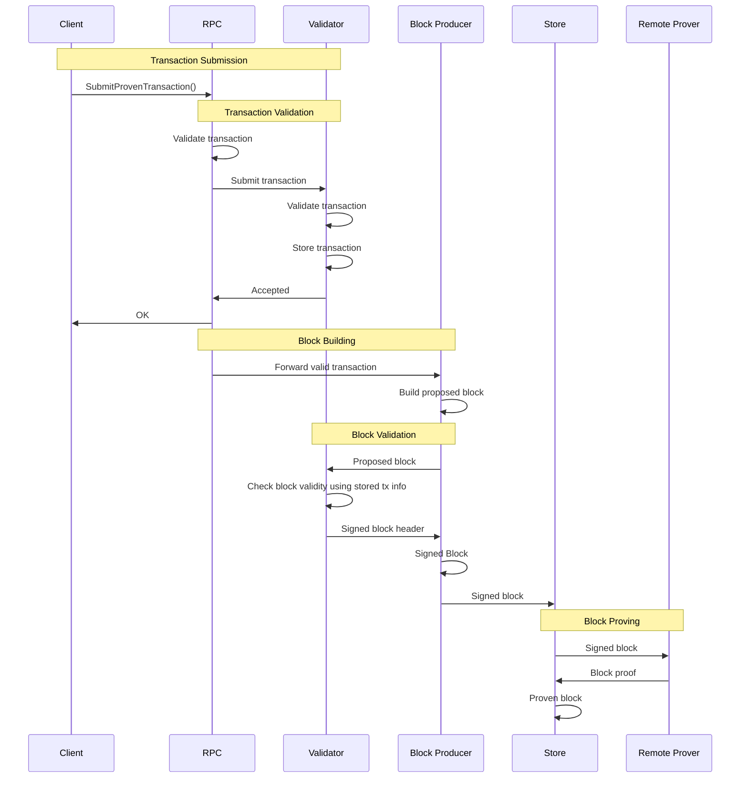

# Miden Validator

The Miden Validator is a temporary component of the Miden node that provides transaction validation and block signing services for the Miden network. It is a core component of the network's "guardrails" that provide additional validation and assurances while the protocol is in active development.

## Overview

The validator component is responsible for:

- **Transaction Validation**: Receiving and re-executing proven transactions from the RPC layer.
- **Transaction Storage**: Persisting re-executed transaction data for block verification and signing.
- **Block Validation**: Verifying blocks produced by the block producer using stored transaction information.
- **Block Signing**: Cryptographically signing valid blocks as part of the consensus process.

## Architecture

The validator operates as a gRPC server and integrates with other Miden node components according to the following flow:

## Current Status

> [!WARNING]
> The validator is currently a **work in progress** and under active development. Many features described above are not yet fully implemented.

### Implemented Features

- ✅ Protobuf schema and gRPC server scaffolding.
- ✅ Transaction submission handler.

### In Development

- 🚧 Transaction re-execution logic.
- 🚧 Database schema and impl.
- 🚧 Block validation logic.
- 🚧 Block signing logic.
- 🚧 Integration with RPC.
- 🚧 Integration with block producer consensus.

## API

The validator exposes a gRPC API with the following endpoints:

- `Status()` - Returns validator health and version information.
- `SubmitProvenTransaction()` - Validates and stores a proven transaction.
- `ValidateBlock()` - Validates a block and returns a signature (TODO).

## Configuration

The validator requires:

- **Address**: Network address for the gRPC server.
- **gRPC Timeout**: Request timeout duration.
- **Data Directory**: Path for SQLite database files.

## License

This project is [MIT licensed](../../LICENSE).
